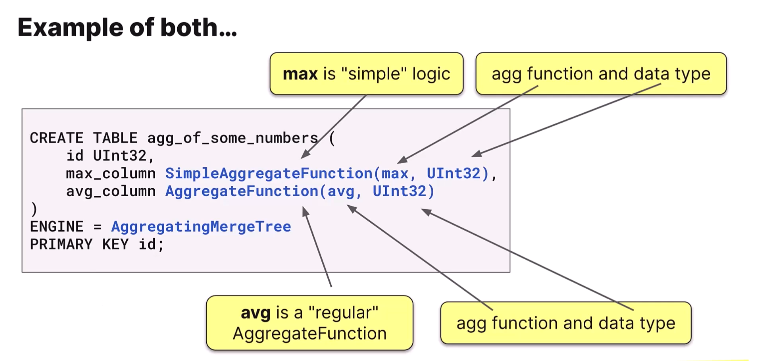
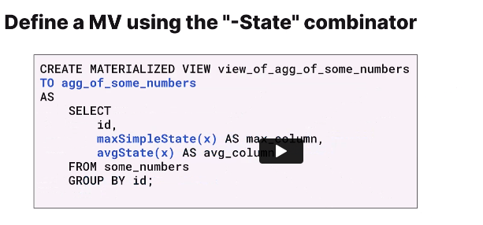
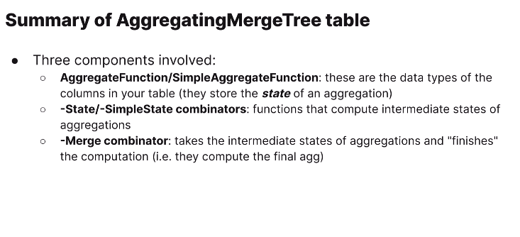

# Aggregations in Materialized Views





## Lab 7.1: Using SummingMergeTree
https://learn.clickhouse.com/learner_module/show/1328942?lesson_id=7481962&section_id=74457621

Run the following query, which groups the uk_price_paid by town and sums the price column:
```sql
select town, 
        sum(price) as sum_price, 
        formatReadableQuantity(sum_price)
    from uk_price_paid
    GROUP BY town
    ORDER BY sum_price DESC
```

If you want to keep a running total, SummingMergeTree is the perfect solution. Create a materialized view that keeps a running sum of the price column for each town in uk_price_paid:

a. Name the view prices_sum_view

b. Name the destination table prices_sum_dest

c. Populate prices_sum_dest with the existing rows in uk_price_paid

```sql
Create or REPLACE table prices_sum_dest(
    town LowCardinality(String),
    sum_price UInt64
)
Engine = SummingMergeTree
Primary Key town


Create Materialized View prices_sum_view
To prices_sum_dest
As
    Select 
        town,
        sum(price) as sum_price
    From uk_price_paid
    Group by town
```