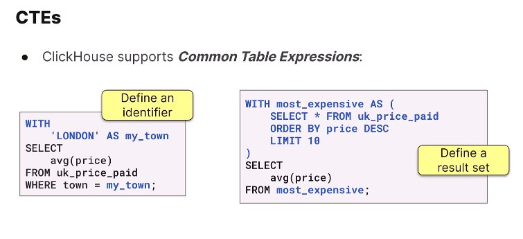

# Analyzing Data


```sql
select count() as count, town
from uk_price_paid
GROUP BY town
ORDER BY count DESc
Format JSONEachROW

```

```sql
WITH most_expensive AS
(
    select town, sum(price) as sum
    from uk_price_paid
    GROUP BY town
    ORDER BY sum Desc 
    LIMIT 10
)
select avg(sum)
from most_expensive
```

```sql
select any(town),
    district,
    count() as c
    from uk_price_paid
    group by district
    order by c desc
    limit 20
```

```sql
WITH now() as today
select today - Interval 1 week
```

## USER DEFINED FUNCTION
```sql
-- USER DEFINED FUNCTIONS

Create FUNCTION mergeAddress as 
(addr1, addr2, street, town, country) -> concat(addr1, addr2, street, town, country)

select mergeAddress(addr1, addr2, street, town, county) from uk_price_paid
```

### ClickHouse Developer On-demand: Module 5
[https://learn.clickhouse.com/learner_module/show/1328915?lesson_id=7481737&section_id=81192209](https://learn.clickhouse.com/learner_module/show/1328915?lesson_id=7481737&section_id=81192209)

**Introduction**:  In this lab, you will write some queries to analyze the UK property prices dataset. Keep in mind that the UK uses pounds for currency, and each row in the table represents a transaction when a piece of property was sold.


Find all properties that sold for more than 100,000,000 pounds, sorted by descending price.

```sql
select * from uk_price_paid
WHERE price > 100000000
order by price desc
```

How many properties were sold for over 1 million pounds in 2022?

```sql
select count() as sold_over_one_mil_in_2022
FROM uk_price_paid
where price > 1000000 and toYear(date) == 2022
```

How many unique towns are in the dataset?

```sql
select uniqExact(town) from uk_price_paid
```

Which town had the highest number of properties sold?

```sql

```