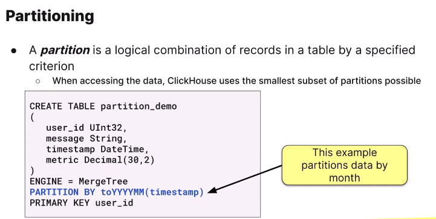

# ClickHouse

## Lab 1.4: Writing Ad-hoc Queries
[Tutorial Link](https://learn.clickhouse.com/learner_module/show/1328489?lesson_id=7667283&section_id=81140575)

We have about 2.3M crypto prices stored in a Parquet file in S3. In this lab, you are going to write queries on that file without ingesting the data into a ClickHouse table.

The crypto prices are saved in a Parquet file in S3. It's a public file and the URL is:

[https://learnclickhouse.s3.us-east-2.amazonaws.com/datasets/crypto_prices.parquet(opens in a new tab)](https://learnclickhouse.s3.us-east-2.amazonaws.com/datasets/crypto_prices.parquet)

1
Using either the command-line SQL client or the ClickHouse Cloud SQL Console, write a query that returns all columns of the first 100 rows using the s3 table function.

```sql
select * from
s3('https://learnclickhouse.s3.us-east-2.amazonaws.com/datasets/crypto_prices.parquet')
limit 100
```

Use the count() function to compute the number of rows in the Parquet file. You should get a count of 2,382,643 rows.

```sql
select count() as count from
s3('https://learnclickhouse.s3.us-east-2.amazonaws.com/datasets/crypto_prices.parquet')

```

There is a handy function named formatReadableQuantity that makes it easier to view large numbers. Pass the count() function into formatReadableQuantity to see how it works.

```sql
select formatReadableQuantity(count()) as count from
s3('https://learnclickhouse.s3.us-east-2.amazonaws.com/datasets/crypto_prices.parquet')

```

What is the average volume of Bitcoin trades?

```sql
select formatReadableQuantity(avg(volume)) as bitcoint_average_volume from
s3('https://learnclickhouse.s3.us-east-2.amazonaws.com/datasets/crypto_prices.parquet')
where crypto_name = 'Bitcoin'
```

Write a query that returns the number of trades for each cryptocurrency (i.e., for each value of crypto_name). Sort the results alphabetically by crypto_name.

```sql
select crypto_name, count() from
s3('https://learnclickhouse.s3.us-east-2.amazonaws.com/datasets/crypto_prices.parquet')
GROUP BY crypto_name
ORDER BY crypto_name ASC
```

Notice there are quite a few crypto names that start with one or more blank characters. The trim function would be useful here - it removes whitespace from Strings. Use trim and notice how it affects the results.

```sql
select trim(crypto_name), count() from
s3('https://learnclickhouse.s3.us-east-2.amazonaws.com/datasets/crypto_prices.parquet')
GROUP BY crypto_name
ORDER BY crypto_name ASC
```

## Lab 2.1: Understanding the Primary Keys in ClickHouse
[https://learn.clickhouse.com/learner_module/show/1328854?lesson_id=7790807&section_id=81141679](https://learn.clickhouse.com/learner_module/show/1328854?lesson_id=7790807&section_id=81141679)  

**A granule is a small block of stored data. Choosing the right primary key helps your database engine skip unnecessary granules during queries, which can greatly improve performance.**  

Run the following command, which shows the 16 column names and types that ClickHouse infers from this Parquet file:  
```sql
DESCRIBE s3('https://datasets-documentation.s3.eu-west-3.amazonaws.com/pypi/2023/pypi_0_7_34.snappy.parquet');

```

Write a query that returns only the first 10 rows of this file, which will give you an idea of what the dataset looks like.  

```sql
SELECT * from  
s3('https://datasets-documentation.s3.eu-west-3.amazonaws.com/pypi/2023/pypi_0_7_34.snappy.parquet') LIMIT 50;
```
How many rows are in the file? (You should get 1,692,671.)

```sql
SELECT count() from
s3('https://datasets-documentation.s3.eu-west-3.amazonaws.com/pypi/2023/pypi_0_7_34.snappy.parquet') LIMIT 50;
```

Create a table to store the PyPI data with the following specs: 

a. The table name is pypi

b. The table only has four columns: TIMESTAMP, COUNTRY_CODE, URL, and PROJECT. (If you are unsure of the column types, check the result of the DESCRIBE command above and ignore the Nullable part of it.)

c. The table engine is MergeTree

d. The primary key is the TIMESTAMP column

```sql
USE training;
CREATE TABLE pypi
(
    TIMESTAMP DateTime64(3, 'UTC'),
    COUNTRY_CODE Nullable(String),
    URL Nullable(String),
    PROJECT Nullable(String)
)
ENGINE = MergeTree
PRIMARY KEY (TIMESTAMP);


INSERT INTO pypi
SELECT TIMESTAMP, COUNTRY_CODE, URL, PROJECT
FROM s3('https://datasets-documentation.s3.eu-west-3.amazonaws.com/pypi/2023/pypi_0_7_34.snappy.parquet');

```


Let's see what happens when we add PROJECT to the primary key. Create the following table named pypi2, and notice that the only change from pypi is that PROJECT was added to the end of the primary key. Run all of the following commands and see what happens:

```sql

SELECT 
    PROJECT,
    count() AS c
FROM pypi2
WHERE PROJECT LIKE 'boto%'
GROUP BY PROJECT
ORDER BY c DESC;
```

## Lab 2.2: Primary Keys and Disk Storage
[https://learn.clickhouse.com/learner_module/show/1328854?lesson_id=7790807&section_id=81141679](https://learn.clickhouse.com/learner_module/show/1328854?lesson_id=7790807&section_id=81141679)

In this lab, you will see how a different primary key can affect the amount of disk space your table uses for storage. Why? Because how your data is sorted can affect how effectively the data can be compressed.

Run the following query, which queries the system.parts table and returns the amount of disk space used by your pypi table:
```sql
SELECT
formatReadableSize(sum(data_compressed_bytes)) as CompressedSize,
formatReadableSize(sum(data_uncompressed_bytes)) as UnComporessedSize,
count() as num_of_active_parts
from system.parts
WHERE(active = 1) and (table = 'pypi')
```

``` sql
SELECT
formatReadableSize(sum(data_compressed_bytes)) as CompressedSize,
formatReadableSize(sum(data_uncompressed_bytes)) as UnComporessedSize,
count() as num_of_active_parts
from system.parts
WHERE(active = 1) and (table LIKE '%pypi%')
GROUP BY table
```
Notice how much better compression you get from your pypi2 table - the compressed size of the pypi2 table is significantly smaller than pypi!

**See All Solutions**
[Soultions](https://github.com/ClickHouse/clickhouse-academy/tree/main/developer/02_clickhouse_architecture)

## Modeling Data
[https://learn.clickhouse.com/learner_module/show/1328860?lesson_id=7951150&section_id=81277855](https://learn.clickhouse.com/learner_module/show/1328860?lesson_id=7951150&section_id=81277855)

### Data Types
```sql
Create TABLE Employee (
    name String,
    hired Date,
    age UInt8
)
ENGINE = MergeTree
PRIMARY KEY (name, hired)

Alter Table Employee 
add Column Meetings Array(DateTime)

Show Create Table Employee
```

```sql
Insert INTO Employee Values
(
    'AmirHosein',
    '2025-06-16',
    28,
    ['2025-07-16 09:00:00']
)
(
    'Ali',
    '2025-06-16',
    28,
    [now(), now() - Interval 1 week]
)
```

**Making a Filed Nullable**
```sql
ALTER TABLE Employee Add COLUMN
my_test Nullable(UInt8)
```

**USING ENUMs**
```sql
ALTER TABLE Employee Add COLUMN
shirt_color Enum('Green' = 1, 'Red' = 2, 'White' = 3)

show create table Employee

Insert into Employee values(
    'Ali', '2005-12-12', 45, [], '', 'Green', 0
)

select * from Employee

INSERT INTO Employee (shirt_color) Values (3)

select * from Employee
```

**LowCardinality**
```sql
ALTER TABLE Employee add COLUMN 
position LowCardinality(String)

insert into Employee (position) Values ('Manager')

select * from Employee
```

### Note:
```sql
|    Order By and Primary Key doing the same thing!
```


### Partitioning



## ClickHouse Developer On-demand: Module 3
[Tutorial Link](https://learn.clickhouse.com/learner_module/show/1328860?lesson_id=7951150&section_id=81277855)

Using the uniqExact function, write a query that returns the unique number of values for the COUNTRY_CODE column. 

```sql
select uniqExact(COUNTRY_CODE) from pypi
```

Using uniqExact again, how many unique values appear in the PROJECT column and the URL column?

```sql

```


Create a new table named pypi3 that is identical to pypi2 but uses LowCardinality for the COUNTRY_CODE and PROJECT columns. Insert all the rows from pypi2 into pypi3.

```sql
DESCRIBE pypi2

show create table pypi2

CREATE TABLE training.pypi3
(
    `TIMESTAMP` DateTime,
    `COUNTRY_CODE` LowCardinality(String),
    `URL` String,
    `PROJECT` LowCardinality(String)
)
PRIMARY KEY (TIMESTAMP, PROJECT)

insert into pypi3 select * from pypi2
```

Let's see how much disk space we saved:

```sql
SELECT
    table,
    formatReadableSize(sum(data_compressed_bytes)) AS compressed_size,
    formatReadableSize(sum(data_uncompressed_bytes)) AS uncompressed_size,
    count() AS num_of_active_parts
FROM system.parts
WHERE (active = 1) AND (table LIKE 'pypi%')
GROUP BY table;
```

Notice we went from 60.54MiB in pypi to 14.90MiB in pypi2 by sorting the data better, and now down to 13.98MiB in pypi3 by using LowCardinality. More importantly, our queries should run faster when filtering on the LowCardinality columns.

Let's see if the queries are faster. Run the following query on both pypi2 and pypi3. Which result is faster? 

```sql
SELECT
    toStartOfMonth(TIMESTAMP) AS month,
    count() AS count
FROM pypi2
WHERE COUNTRY_CODE = 'US'
GROUP BY
    month
ORDER BY
    month ASC,
    count DESC;


SELECT
    toStartOfMonth(TIMESTAMP) AS month,
    count() AS count
FROM pypi3
WHERE COUNTRY_CODE = 'US'
GROUP BY
    month
ORDER BY
    month ASC,
    count DESC;
```

Notice the queries are considerably faster on pypi3 (almost twice as fast)...and this is a small dataset! We could see big improvements in both compression and query performance doing this over billions and billions of rows. 

### Lab 3.2: Defining a MergeTree Table

Run the following command, which shows the data types that ClickHouse infers from the Parquet file:

```sql
DESCRIBE s3('https://learnclickhouse.s3.us-east-2.amazonaws.com/datasets/crypto_prices.parquet');

```

Define a new table named crypto_prices that satisfies the following requirements:

- a. Use the column names and data types above, except: 

- i. do not use Nullable on any columns

- ii. change trade_date to a Date

- iii. use LowCardinality for the crypto_name

- b. The table engine is MergeTree

- c. The primary key is the crypto_name followed by the trade_date

```sql
DESCRIBE s3('https://learnclickhouse.s3.us-east-2.amazonaws.com/datasets/crypto_prices.parquet');


Create Table crypto_prices (
    trade_date Date,
    crypto_name LowCardinality(String),
    volume Float32,
    price Float32,
    maket_cap Float32,
    change_1_day Float32
)
ENGINE = MergeTree
PRIMARY KEY (crypto_name, trade_date)
```

Insert all of the data from the parquet file in S3 into your new crypto_prices table.

```sql
INSERT INTO crypto_prices 
select * from 
s3('https://learnclickhouse.s3.us-east-2.amazonaws.com/datasets/crypto_prices.parquet');
```

Verify you have all the data by counting the number of rows (you should get 2,382,643 rows).

```sql
select count() from crypto_prices
```

Run a query that returns the count of rows where volume >= 1000_000. How many rows of the table were read to compute this result?

```sql

```

Using the avg function on the price column, find the average price of 'Bitcoin'. How many granules were processed, and why is it smaller than the previous query that filtered on the volume column?

```sql
select avg(price), crypto_name 
from crypto_prices
where crypto_name = 'Bitcoin'
GROUP BY crypto_name
```

What is the average price of all trades where the name of the cryptocurrency name starts with a capital 'B'? You can use the standard LIKE from SQL. Notice how many granules were processed. Clearly the primary index was also useful in this query.

```sql
select avg(price)
from crypto_prices
where crypto_name LIKE 'B%'
```

### Lab Solution
[Solitions](https://github.com/ClickHouse/clickhouse-academy/tree/main/developer/03_modeling_data)

## ClickHouse Developer On-demand: Module 4
### Inserting Data
[https://learn.clickhouse.com/learner_module/show/1328910?lesson_id=7672008&section_id=74457604](https://learn.clickhouse.com/learner_module/show/1328910?lesson_id=7672008&section_id=74457604)


### Inserting Local File


```
Note: Pay attention to data sources menu in clickhouse cloud
```

The data that you are going to insert is in a compressed Parquet file in S3. Use the DESCRIBE command and the s3 table function to view the schema of the data in the following Parquet file:     

https://learn-clickhouse.s3.us-east-2.amazonaws.com/uk_property_prices.snappy.parquet(opens in a new tab)

Use the DESCRIBE command on the s3 table function to view the schema of the data in the Parquet file.

```sql
DESC s3('https://learn-clickhouse.s3.us-east-2.amazonaws.com/uk_property_prices.snappy.parquet')
```

Create a table that satisfies the following criteria:

- a. The name of the table is uk_price_paid

- b. Use the same column names that are in the Parquet file (the names returned from the DESCRIBE command)

- c. Do not use NULLABLE on any column

- d. The date column should be a Date

- e. Make all of the String columns LowCardinality except addr1 and addr2

- f. The type column is an enumeration that has the values:
'terraced' = 1, 'semi-detached' = 2, 'detached' = 3, 'flat' = 4, 'other' = 0

- g. The duration column is an enumeration that has the values: 'freehold' = 1, 'leasehold' = 2, 'unknown' = 0

- h. The table engine is MergeTree

- i. The primary key is postcode1, postcode2, date (in that order)


Insert all of the rows from the Parquet file into uk_price_paid.

Verify you have all the data by counting the number of rows - you should get 28,634,236.

```sql
Create table uk_price_paid(
    price	UInt32,
    date	Date,
    postcode1	LowCardinality(String),
    postcode2	LowCardinality(String),
    type	Enum('terraced' = 1, 'semi-detached' = 2, 'detached' = 3, 'flat' = 4, 'other' = 0),
    is_new	UInt8,
    duration	Enum('freehold' = 1, 'leasehold' = 2, 'unknown' = 0),
    addr1	String,
    addr2	String,
    street	LowCardinality(String),
    locality	LowCardinality(String),
    town	LowCardinality(String),
    district	LowCardinality(String),
    county	LowCardinality(String)
)
ENGINE = MergeTree
Primary Key(postcode1, postcode2, date)

insert into uk_price_paid
select * from s3('https://learn-clickhouse.s3.us-east-2.amazonaws.com/uk_property_prices.snappy.parquet');

```

Using the avg() function, compute the average price of properties sold where postcode1 equals LU1 and postcode2 equals 5FT. Notice the query only has to read a few thousands of rows (a handful of granules!). Why are so few rows processed?

```sql
select avg(price) from uk_price_paid
where postcode1 = 'LU1' and postcode2 = '5FT'
```

Modify the previous query but only filter on rows where postcode2 equals 5FT. Notice it doesn't scan every row in the table, but it scans a large number (around 19-20M rows). Why did it need to process so many rows?

```sql
select avg(price) from uk_price_paid
where postcode2 = '5FT'
```

Similar to the previous query, find the average price of properties sold in the town of YORK. Notice every row is read to compute the result. Why are so many rows processed?

```sql
select avg(price) from uk_price_paid
where town = 'YORK'
```

### Working with File
The file is saved with a .csv extension, but notice the delimiter is a ~ character instead of a comma. Write a query that counts the number of rows in this file, which is found at https://learn-clickhouse.s3.us-east-2.amazonaws.com/operating_budget.csv.

```sql
SELECT count() FROM
s3('https://learn-clickhouse.s3.us-east-2.amazonaws.com/operating_budget.csv')
SETTINGS format_csv_delimiter = '~'
```

Run a query that sums up the actual_amount column, which would represent how much money was actually spent for the year. You should get back about $8.16 billion dollars.

```sql
SELECT formatReadableQuantity(sum(actual_amount)) FROM
s3('https://learn-clickhouse.s3.us-east-2.amazonaws.com/operating_budget.csv')
SETTINGS format_csv_delimiter = '~'
```

Try to run a query that sums up the approved_amount column, which would represent how much money was actually spent for the year. What is the issue?

```sql
SELECT formatReadableQuantity(sum(approved_amount)) FROM
s3('https://learn-clickhouse.s3.us-east-2.amazonaws.com/operating_budget.csv')
SETTINGS format_csv_delimiter = '~'
```

Run the DESCRIBE command on the table function to view the inferred schema. Notice that both the approved_amount and recommended_amount columns are inferred as Nullable(String), even though most of the values are numeric dollar amounts.

One clever trick you can use is to cast the string column into a numeric value using a function like toUInt32OrZero. If one of the values in a row is not a valid integer, the function will return 0. Write a query that uses toUInt32OrZero to sum up the values of both the approved_amount and recommended_amount columns.

```sql
SELECT formatReadableQuantity(sum(toUInt32OrZero(approved_amount))),
formatReadableQuantity(sum(toUInt32OrZero(recommended_amount))) FROM
s3('https://learn-clickhouse.s3.us-east-2.amazonaws.com/operating_budget.csv')
SETTINGS format_csv_delimiter = '~'
```

The issue with the approved_amount and recommended_amount columns is that a handful of rows contain "n/a" instead of a numeric value, so their inferred data type is String. Try running the following query, which uses the schema_inference_hints setting and suggests the data type for these two columns to be UInt32. Does it work? Why? 

```sql
SELECT 
    formatReadableQuantity(sum(approved_amount)),
    formatReadableQuantity(sum(recommended_amount))
FROM s3('https://learn-clickhouse.s3.us-east-2.amazonaws.com/operating_budget.csv')
SETTINGS 
format_csv_delimiter='~',
schema_inference_hints='approved_amount UInt32, recommended_amount UInt32';
```

The schema_inference_hints setting can be a great time saver, but for this particular CSV file it is not helping. To really make this work, we need to ingest the data into a MergeTree table with proper data types. Start by creating a new table named operating_budget that satisfies the following requirements:

- a. Uses the MergeTree table engine

- b. Contains the following columns as LowCardinality(String):

-i. fiscal_year, service, department, program, -item_category, and fund

- c. Contains a String column for description

- d. Contains the following columns as UInt32:

-i. approved_amount and recommended_amount

- e. Contains a new program_code column as LowCardinality(String). This data is derived from the program column as explained later.

- f. Contains a Decimal(12,2) column for actual_amount

g . The fund_type is an Enum with three values:

i. GENERAL FUNDS, FEDERAL FUNDS, and OTHER FUNDS

h . The PRIMARY KEY is (fiscal_year, program)

i. Don't forget to set the format_csv_delimiter setting to '~'.

```sql
CREATE TABLE operating_budget (
    fiscal_year LowCardinality(String),
    service LowCardinality(String),
    department LowCardinality(String),
    program LowCardinality(String),
    program_code LowCardinality(String),
    description String,
    item_category LowCardinality(String),
    approved_amount UInt32,
    recommended_amount UInt32,
    actual_amount Decimal(12,2),
    fund LowCardinality(String),
    fund_type Enum8('GENERAL FUNDS' = 1, 'FEDERAL FUNDS' = 2, 'OTHER FUNDS' = 3)
)
ENGINE = MergeTree
PRIMARY KEY (fiscal_year, program);
```

This part will be tricky. Insert all of the rows from the following link into your operating_budget table.

https://learn-clickhouse.s3.us-east-2.amazonaws.com/operating_budget.csv(opens in a new tab)

Here are some tips to help you along the way:

a. Use CSV for the input format, and skip the first row (look in the docs for the input_format_csv_skip_first_lines setting. Why? Because the inferred column names of the incoming data match the table column names, and you will need to perform some operations on the incoming data. By using different names for the incoming columns, this will avoid conflicting names (which throws an error)

b. Specify the schema of the incoming data (as opposed to using the schema inference). Use temporary column names, different than those in the operating_budget table

c. The program column contains a string followed by a code in parentheses. For example:

GENERAL OPERATIONS (111)

You will need to send the string to the program column (e.g. GENERAL OPERATIONS) and the code to the program_code column (e.g. 111). Use any function or technique you prefer (the splitByChar function might be handy). Also, we recommend defining the program_code as a String.

d. You will need to convert the incoming approved_amount, recommended_amount and actual_amount columns to their appropriate data type.

e. There is no single, correct way to complete this task! Use any functions or SQL you can to make it work.

```sql
INSERT INTO operating_budget
    WITH
        splitByChar('(', c4) AS result
    SELECT
        c1 AS fiscal_year,
        c2 AS service,
        c3 AS department,
        result[1] AS program,
        splitByChar(')',result[2])[1] AS program_code,
        c5 AS description,
        c6 AS item_category,
        toUInt32OrZero(c7) AS approved_amount,
        toUInt32OrZero(c8) AS recommended_amount,
        toDecimal64(c9, 2) AS actual_amount,
        c10 AS fund,
        c11 AS fund_type
    FROM s3(
        'https://learn-clickhouse.s3.us-east-2.amazonaws.com/operating_budget.csv',
        'CSV',
        'c1 String,
        c2 String,
        c3 String,
        c4 String,
        c5 String,
        c6 String,
        c7 String,
        c8 String,
        c9 String,
        c10 String,
        c11 String'
        )
    SETTINGS
        format_csv_delimiter = '~',
        input_format_csv_skip_first_lines=1;
```

Write a query that sums the approved_amount column for fiscal_year equal to 2022. You should get about $5.09 billion.

```sql
SELECT formatReadableQuantity(sum(approved_amount)) from operating_budget
where fiscal_year='2022'
```

Write a query that sums the actual_amount of money spent in 2022 for the program_code 031 (the AGRICULTURE & ENVIRONMENTAL SERVICES program). You should get back $8,058,173.43.

```sql
SELECT formatReadableQuantity(sum(actual_amount)) 
from operating_budget
where fiscal_year='2022' and program_code='031'
```

## Analyzing Data
 [Laboratory Link](https://learn.clickhouse.com/learner_module/show/1328915?lesson_id=7481737&section_id=81192209)

 To read the document go to:  
 [Analyzing Data](AnalyzingData.md)